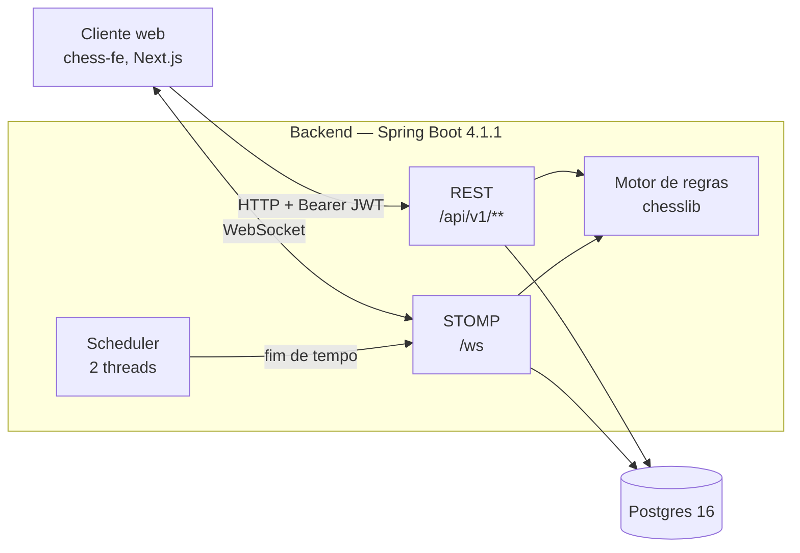
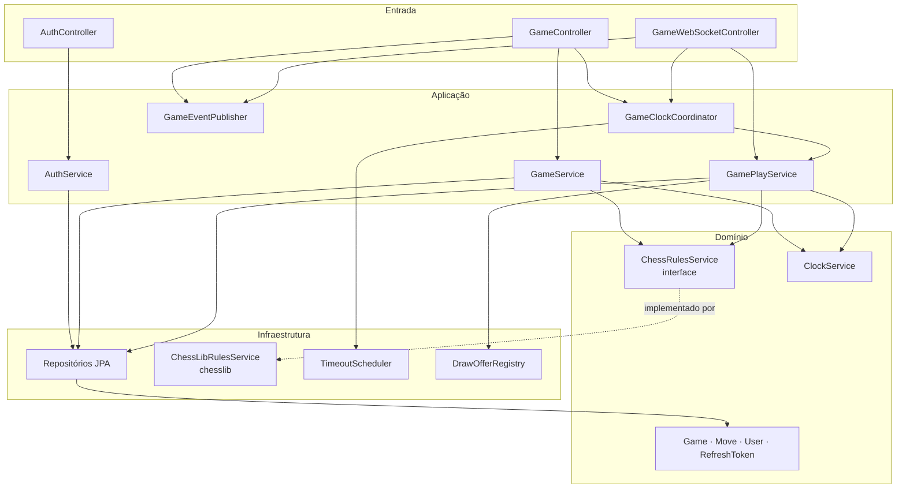
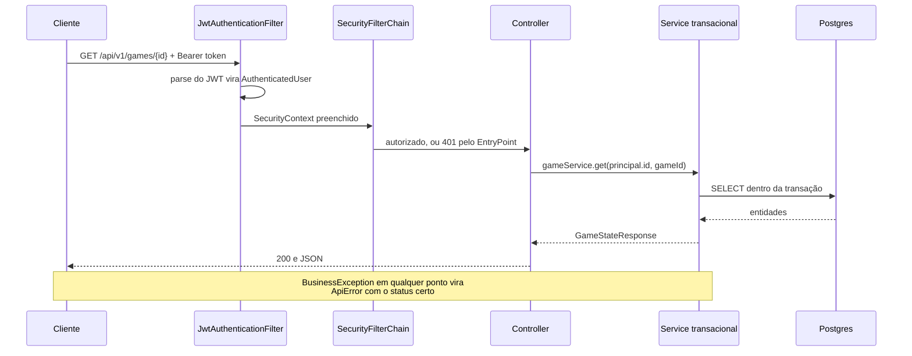
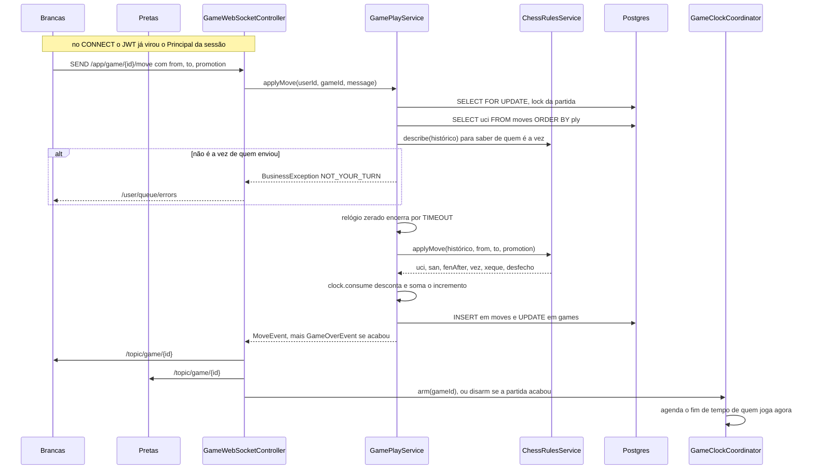
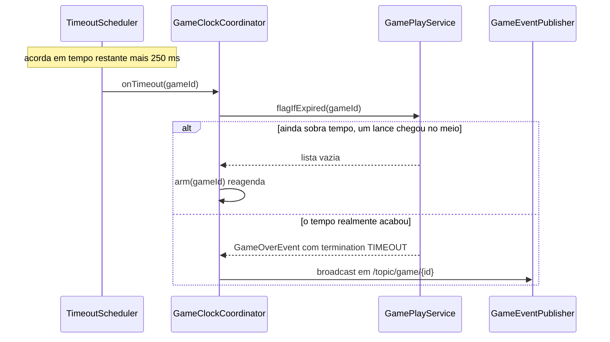

# Arquitetura

O que você encontra aqui: as fronteiras do sistema, como uma requisição REST e um lance de
xadrez atravessam o código, o modelo de concorrência que impede dois lances simultâneos de se
atropelarem, e as limitações conhecidas da implementação atual.

## Fronteiras

O backend é um monolito Spring Boot com um único banco Postgres. Não há outros serviços, filas
externas nem cache distribuído.

A divisão entre os dois canais é deliberada:

| Canal | Usado para | Por quê |
|---|---|---|
| REST | criar, entrar, consultar e cancelar partida | operações pontuais, iniciadas pelo cliente, que se beneficiam de status HTTP e de retry |
| STOMP | lance, desistência, empate, fim de tempo | precisam ser **empurradas** para o adversário no instante em que acontecem |

Uma consequência prática: o evento `GAME_STARTED` é publicado pelo **REST**
(`GameController.java:60`), quando o segundo jogador entra — e não por uma mensagem STOMP.
O cliente que criou a partida só descobre que ela começou porque já está inscrito no tópico.

## Camadas

O ponto de inversão de dependência é o `ChessRulesService`
(`game/engine/ChessRulesService.java`): o domínio depende da interface, e a chesslib fica
isolada em `ChessLibRulesService`. Nenhuma classe fora do pacote `game.engine` importa
`com.github.bhlangonijr`.

## Fluxo de uma requisição REST

Detalhes que importam:

- O filtro **nunca rejeita** a requisição. Se o header estiver ausente ou o token for inválido,
  ele simplesmente não popula o `SecurityContext`
  (`auth/security/JwtAuthenticationFilter.java:35`); quem devolve 401 é o `SecurityFilterChain`
  através do `RestAuthenticationEntryPoint`.
- A sessão é `STATELESS` (`config/SecurityConfig.java:34`): nenhum `JSESSIONID`, nenhum estado
  de autenticação no servidor.
- `open-in-view: false` no `application.yml` — nada de lazy loading depois que o service
  retorna. Por isso os DTOs são montados dentro da transação, em `GameService.state`
  (`game/service/GameService.java:112`).

## Fluxo de um lance

Este é o caminho crítico do sistema.

Observações sobre esse fluxo:

1. **A validação da vez usa o histórico, não a coluna `current_fen`.** `describe(history)`
   (`game/service/GamePlayService.java:57`) reconstrói a posição do zero. Ver
   [modulos/engine.md](modulos/engine.md).
2. **O relógio é conferido antes da regra.** Se o tempo de quem joga já acabou, o lance nem
   chega a ser avaliado: a partida termina por `TIMEOUT` (`GamePlayService.java:62-63`).
3. **A publicação acontece depois do service, no controller.** `GameEventPublisher.broadcast`
   é chamado por `GameWebSocketController.move` (`game/GameWebSocketController.java:53`), fora
   da transação — se o commit falhar, nada foi transmitido.
4. **O relógio é rearmado por último**, também no controller
   (`GameWebSocketController.java:79-86`), com `disarm` quando um `GameOverEvent` aparece na
   lista de eventos.

## Modelo de concorrência

Três fontes de escrita concorrente disputam a mesma partida: os dois jogadores e o scheduler
de timeout. A estratégia é **serializar por partida com lock pessimista**.

| Mecanismo | Onde | Papel |
|---|---|---|
| `SELECT FOR UPDATE` | `game/repository/GameRepository.java:21-23` | serializa lance, desistência, resposta de empate e a marcação de timeout |
| `TaskScheduler` de 2 threads | `config/SchedulingConfig.java` | dispara o fim de tempo; threads nomeadas `chess-clock-*` |
| `ConcurrentHashMap` | `DrawOfferRegistry`, `TimeoutScheduler` | estado volátil, fora de transação |

`GamePlayService.lockGame` (`:175`) é usado por `applyMove`, `resign` e `respondToDraw`.
`flagIfExpired` (`:108`) também pega o lock — é o que impede a corrida clássica: o jogador
envia o lance no último milissegundo enquanto o scheduler já acordou para derrubar a bandeira.
Um dos dois pega o lock primeiro; o outro encontra a partida em estado incompatível e desiste.
`offerDraw` (`:144`) é a única operação sem lock, porque só escreve no registry em memória.

O `arm` e o `disarm` do relógio ficam **fora** da transação de propósito: agendar dentro dela
poderia disparar o timeout antes do commit, e o scheduler leria um estado que ainda não existe
no banco.

## Fim de tempo

A margem de 250 ms (`GRACE`, `game/service/TimeoutScheduler.java:20`) evita que o scheduler
acorde microssegundos cedo demais, encontre "ainda sobra 1 ms" e entre em reagendamentos em
cascata. Detalhes em [modulos/relogio.md](modulos/relogio.md).

## Segurança em uma olhada

- Access token JWT HS256, TTL de 15 minutos, enviado no header `Authorization`.
- Refresh token opaco de 32 bytes, guardado **como hash SHA-256**, entregue em cookie
  `HttpOnly` com `Path=/api/v1/auth`, rotacionado a cada uso.
- Senha com BCrypt força 12 (`config/SecurityConfig.java:52`).
- CSRF desabilitado — é uma API sem sessão, e o cookie de refresh é `SameSite=Lax`.
- O handshake do WebSocket é `permitAll` (`SecurityConfig.java:43`); a autenticação real
  acontece no frame STOMP CONNECT. Ver [websocket.md](websocket.md).

## Limitações conhecidas

Nenhuma delas é bug: são consequências assumidas do escopo atual. Estão aqui para que ninguém
descubra do jeito difícil.

| Limitação | Efeito prático | Onde nasce |
|---|---|---|
| **Instância única** | broker, propostas de empate e agendamentos vivem na memória do processo | `WebSocketConfig.java:36`, `DrawOfferRegistry`, `TimeoutScheduler` |
| **Reinício perde timeouts** | uma partida em andamento fica sem agendamento até alguém interagir | `TimeoutScheduler` |
| **Sem replay de eventos** | cliente que cai no meio precisa de `GET /api/v1/games/{id}` para se ressincronizar | não há buffer de eventos |
| **Sem listagem de partidas** | não existe "minhas partidas" nem histórico | só `GET /{id}` em `GameController` |
| **Sem rota `/me`** | o cliente precisa guardar o `UserResponse` devolvido no login | `AuthController` |
| **Refresh tokens nunca são limpos** | a tabela `refresh_tokens` cresce indefinidamente | sem job de limpeza |
| **`revokeAllForUser` sem chamador** | não há "sair de todos os dispositivos" | `RefreshTokenService.java:71` |
| **Sem rate limiting** | login e registro aceitam tentativas ilimitadas | `SecurityConfig` |
| **Partida abandonada não expira** | uma partida `WAITING` fica para sempre; uma `IN_PROGRESS` só acaba quando um relógio zera | `GameService` |
| **Custo O(n) por lance** | todo o histórico é reproduzido a cada operação | [modulos/engine.md](modulos/engine.md) |

## Veja também

- [decisoes.md](decisoes.md) — o porquê de cada escolha acima
- [modulos/game.md](modulos/game.md) — a máquina de estados da partida
- [modulos/relogio.md](modulos/relogio.md) — a aritmética do relógio
- [banco-de-dados.md](banco-de-dados.md) — o esquema que sustenta tudo isso
