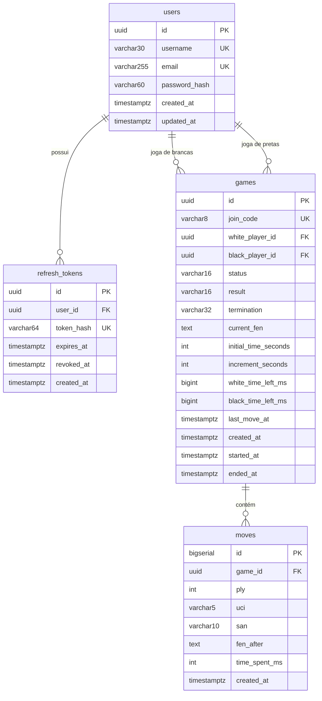

# Banco de dados

O que você encontra aqui: o esquema completo do Postgres, o motivo de cada constraint, o mapa
entre colunas e campos das entidades JPA, e o procedimento para criar uma migration nova sem
quebrar o build.

O esquema é gerenciado **exclusivamente pelo Flyway**. O Hibernate roda com
`ddl-auto: validate` (`application.yml`), ou seja: ele confere se as entidades batem com as
tabelas e **recusa subir** se não baterem. Nunca gera nem altera DDL.

## Visão geral

Todos os horários são `TIMESTAMPTZ` e o Hibernate está fixado em UTC
(`hibernate.jdbc.time_zone: UTC`, em `application.yml`). Nada de horário local no banco.

## `users`

Criada em `V1__create_users.sql`. Entidade: `user/User.java`.

| Coluna | Tipo | Nulo | Campo Java | Observação |
|---|---|---|---|---|
| `id` | `UUID` | não | `id` | PK gerada pelo Hibernate (`GenerationType.UUID`) |
| `username` | `VARCHAR(30)` | não | `username` | guardado como digitado; a unicidade é case-insensitive |
| `email` | `VARCHAR(255)` | não | `email` | gravado em minúsculas por `AuthService.register` (`auth/service/AuthService.java:50`) |
| `password_hash` | `VARCHAR(60)` | não | `passwordHash` | 60 é exatamente o tamanho de um hash BCrypt |
| `created_at` | `TIMESTAMPTZ` | não | `createdAt` | `@CreationTimestamp` + `DEFAULT now()` |
| `updated_at` | `TIMESTAMPTZ` | não | `updatedAt` | `@UpdateTimestamp` |

**Constraints e o porquê:**

- `chk_users_username_format` — `^[A-Za-z0-9_]{3,30}$`. A mesma regra existe como `@Pattern` no
  `RegisterRequest`, mas o banco é a última linha de defesa: dado inválido não entra nem por
  script manual.
- `idx_users_username_lower` e `idx_users_email_lower` — índices **únicos funcionais** sobre
  `LOWER(coluna)`. Isso dá unicidade case-insensitive sem precisar de uma coluna normalizada
  extra, e é o mesmo índice que serve as consultas `existsByUsernameIgnoreCase` e
  `findByUsernameOrEmail` (`user/UserRepository.java`).

A checagem de duplicidade acontece no service **antes** do insert, devolvendo
`USERNAME_TAKEN`/`EMAIL_TAKEN` (`AuthService.java:42` e `:45`). O índice único cobre a corrida
entre dois registros simultâneos — nesse caso raro, a violação vira `500 INTERNAL_ERROR`, não
um `409`.

## `refresh_tokens`

Criada em `V2__create_refresh_tokens.sql`. Entidade: `auth/entity/RefreshToken.java`.

| Coluna | Tipo | Nulo | Campo Java | Observação |
|---|---|---|---|---|
| `id` | `UUID` | não | `id` | PK |
| `user_id` | `UUID` | não | `user` | FK para `users`, `ON DELETE CASCADE` |
| `token_hash` | `VARCHAR(64)` | não | `tokenHash` | SHA-256 em hexadecimal: 64 caracteres |
| `expires_at` | `TIMESTAMPTZ` | não | `expiresAt` | `created_at` + `app.jwt.refresh-token-ttl` (7 dias) |
| `revoked_at` | `TIMESTAMPTZ` | sim | `revokedAt` | preenchido no uso (rotação) ou no logout |
| `created_at` | `TIMESTAMPTZ` | não | `createdAt` | |

**O ponto central desta tabela** está no comentário da própria migration: só o **hash** do
token é armazenado. O valor em claro existe apenas no cookie do cliente, então um vazamento do
banco não permite forjar sessões. A busca é sempre por hash
(`RefreshTokenService.consume`, `auth/service/RefreshTokenService.java:49`).

`revoked_at` nulo não significa válido: `RefreshToken.isUsable` exige `revokedAt == null`
**e** `expiresAt` no futuro. Um token nunca é apagado — vira histórico. Ver
[a limitação sobre crescimento da tabela](arquitetura.md#limitações-conhecidas).

## `games`

Criada em `V3__create_games.sql`, ampliada em `V5__add_clock.sql`. Entidade: `game/Game.java`.

| Coluna | Tipo | Nulo | Campo Java | Observação |
|---|---|---|---|---|
| `id` | `UUID` | não | `id` | PK |
| `join_code` | `VARCHAR(8)` | não | `joinCode` | único; hoje sempre com 6 caracteres |
| `white_player_id` | `UUID` | sim | `whitePlayer` | nulo enquanto o lado está vago |
| `black_player_id` | `UUID` | sim | `blackPlayer` | idem |
| `status` | `VARCHAR(16)` | não | `status` | enum `GameStatus` como texto |
| `result` | `VARCHAR(16)` | sim | `result` | enum `GameResult`; nulo enquanto não terminou |
| `termination` | `VARCHAR(32)` | sim | `termination` | enum `Termination` |
| `current_fen` | `TEXT` | não | `currentFen` | **cache de leitura**, não fonte de verdade |
| `initial_time_seconds` | `INT` | não | `initialTimeSeconds` | imutável (`updatable = false`) |
| `increment_seconds` | `INT` | não | `incrementSeconds` | imutável |
| `white_time_left_ms` | `BIGINT` | não | `whiteTimeLeftMs` | saldo **do último lance**, não em tempo real |
| `black_time_left_ms` | `BIGINT` | não | `blackTimeLeftMs` | idem |
| `last_move_at` | `TIMESTAMPTZ` | sim | `lastMoveAt` | marco a partir do qual o relógio corre |
| `created_at` | `TIMESTAMPTZ` | não | `createdAt` | |
| `started_at` | `TIMESTAMPTZ` | sim | `startedAt` | preenchido quando o segundo jogador entra |
| `ended_at` | `TIMESTAMPTZ` | sim | `endedAt` | preenchido por `Game.finish` (`game/Game.java:143`) |

**Constraints e o porquê:**

| Constraint | Garante |
|---|---|
| `chk_games_status` | `status` só aceita `WAITING`, `IN_PROGRESS`, `FINISHED`, `ABORTED` |
| `chk_games_result` | nulo, ou `WHITE_WIN`/`BLACK_WIN`/`DRAW` |
| `chk_games_termination` | nulo, ou um dos 8 motivos de término (incluindo `TIMEOUT`, adicionado na V5) |
| `chk_games_jogadores_distintos` | ninguém joga contra si mesmo, mesmo por insert manual |
| `chk_games_dois_jogadores` | fora de `WAITING`, os dois lados precisam estar ocupados |
| `chk_games_tempo_valido` | `initial_time_seconds > 0` e `increment_seconds >= 0` |

Os índices `idx_games_white` e `idx_games_black` são `(jogador, created_at DESC)` — preparados
para uma listagem "minhas partidas, mais recentes primeiro" que **ainda não existe** como
endpoint.

> **`current_fen` é cache.** A posição real é sempre reconstruída pelo replay de `moves`. Se as
> duas divergirem, quem manda é `moves`. Ver [modulos/engine.md](modulos/engine.md).

> **`white_time_left_ms` também não é o relógio ao vivo.** Ele guarda o saldo congelado no
> último lance; o tempo corrido desde `last_move_at` é descontado em memória por
> `ClockService.snapshot`. Ver [modulos/relogio.md](modulos/relogio.md).

## `moves`

Criada em `V4__create_moves.sql`, ampliada em `V5__add_clock.sql`. Entidade: `game/Move.java`.

| Coluna | Tipo | Nulo | Campo Java | Observação |
|---|---|---|---|---|
| `id` | `BIGSERIAL` | não | `id` | PK sequencial (`GenerationType.IDENTITY`) |
| `game_id` | `UUID` | não | `game` | FK, `ON DELETE CASCADE` |
| `ply` | `INT` | não | `ply` | meio-lance, começando em 1 |
| `uci` | `VARCHAR(5)` | não | `uci` | `e2e4`, ou `g7h8q` com promoção |
| `san` | `VARCHAR(10)` | não | `san` | `Nf3`, `O-O-O`, `gxh8=Q+` |
| `fen_after` | `TEXT` | não | `fenAfter` | posição depois do lance |
| `time_spent_ms` | `INT` | sim | `timeSpentMs` | nulo nos lances anteriores à V5 |
| `created_at` | `TIMESTAMPTZ` | não | `createdAt` | |

**Constraints e o porquê:**

- `uq_moves_game_ply` — impede dois lances com o mesmo número na mesma partida. É a rede de
  segurança do banco contra dois lances concorrentes; o lock pessimista em `games` é a primeira.
- `chk_moves_ply` — `ply > 0`. O primeiro lance é 1, não 0.

Esta é a **tabela append-only mais importante do sistema**: ela é o log que reconstrói qualquer
posição. Nenhum código faz `UPDATE` ou `DELETE` em `moves`.

## Enums Java × CHECK do banco

Três enums são gravados como texto e espelhados em constraints:

| Enum Java | Coluna | Constraint |
|---|---|---|
| `game/GameStatus.java` | `games.status` | `chk_games_status` |
| `game/GameResult.java` | `games.result` | `chk_games_result` |
| `game/Termination.java` | `games.termination` | `chk_games_termination` |

**Adicionar um valor no enum sem alterar o CHECK produz um erro em runtime, no primeiro insert
que usar o valor novo** — e não no startup, porque `validate` não inspeciona CHECK. O jeito
certo está em `V5__add_clock.sql`: `DROP CONSTRAINT` e `ADD CONSTRAINT` com a lista completa.

## Migrations

Localização: `src/main/resources/db/migration/`. Aplicadas no startup
(`spring.flyway.enabled: true`).

| Versão | O que trouxe |
|---|---|
| `V1__create_users.sql` | `users`, formato do username, unicidade case-insensitive |
| `V2__create_refresh_tokens.sql` | `refresh_tokens` com hash do token |
| `V3__create_games.sql` | `games`, os três CHECK de enum e as regras de ocupação dos lados |
| `V4__create_moves.sql` | `moves` e a unicidade `(game_id, ply)` |
| `V5__add_clock.sql` | relógio: tempo inicial, incremento, saldos, `last_move_at`, `TIMEOUT` e `moves.time_spent_ms` |

`V5` é o modelo a seguir para migrations em tabela que já tem dados: adiciona coluna com
`DEFAULT`, faz o backfill (`UPDATE ... SET white_time_left_ms = initial_time_seconds * 1000`),
remove o `DEFAULT` e só então aplica o `NOT NULL`.

### Criando a V6

1. Nome: `V6__descricao_curta.sql`, com dois underscores depois da versão.
2. Escreva o DDL e, se a tabela já tiver dados, o backfill.
3. Se mexeu em enum, atualize o CHECK correspondente.
4. Ajuste a entidade JPA para bater exatamente com o resultado.
5. Rode `./mvnw test` — o `ChessApplicationTests.contextLoads` aplica as migrations contra um
   Postgres limpo e valida as entidades. É o teste mais barato de "eu quebrei o esquema".

**Nunca edite uma migration já aplicada.** O Flyway guarda o checksum de cada arquivo em
`flyway_schema_history` e recusa subir se algum mudou. Para reverter em desenvolvimento, o
caminho é `docker compose down -v` e subir de novo.

## Veja também

- [modulos/engine.md](modulos/engine.md) — por que `moves` vale mais que `current_fen`
- [modulos/relogio.md](modulos/relogio.md) — como as colunas de tempo são usadas
- [desenvolvimento.md](desenvolvimento.md) — resetar o banco, conectar com psql
- [modulos/auth.md](modulos/auth.md) — ciclo de vida dos refresh tokens
