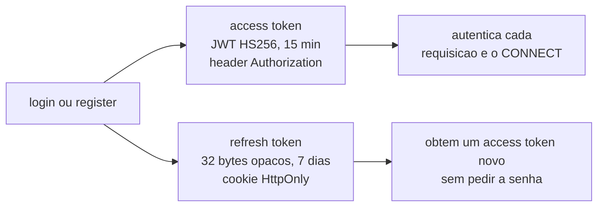
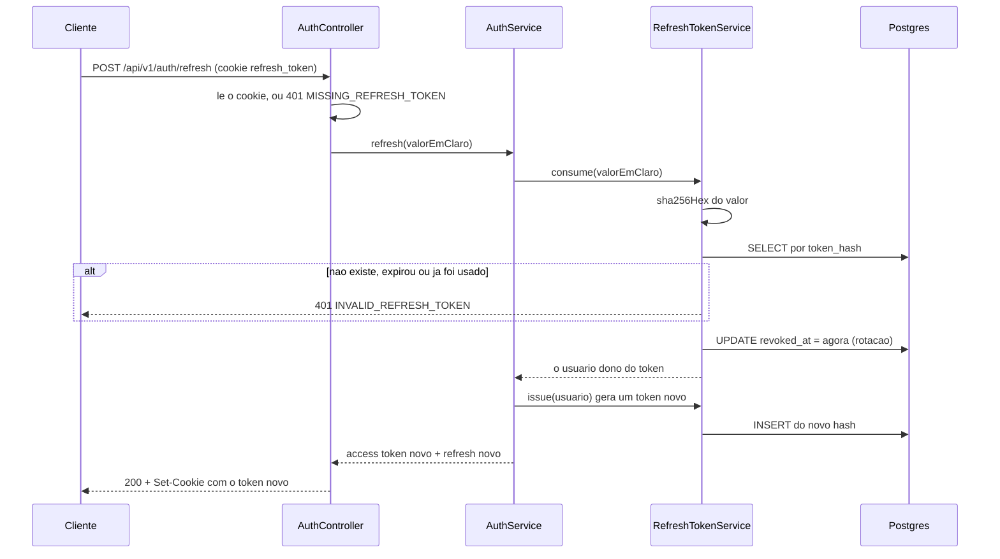

# Módulo `auth`

O que você encontra aqui: como um usuário nasce, como uma sessão é criada e renovada, e por que
cada peça do esquema de tokens é do jeito que é. O contrato HTTP dessas rotas está em
[api-rest.md](../api-rest.md); aqui é o funcionamento por dentro.

Pacote: `com.sergiofagundes.chess.auth` (mais `user`, com a entidade `User`).

## Peças

| Classe | Papel |
|---|---|
| `AuthController` | as quatro rotas e a manipulação do cookie |
| `AuthService` | registro, login, refresh e logout |
| `JwtService` | gera e valida o access token |
| `RefreshTokenService` | emite, consome e revoga refresh tokens |
| `RefreshTokenCookies` | monta e lê o cookie `refresh_token` |
| `JwtAuthenticationFilter` | lê o header `Authorization` nas requisições HTTP |
| `StompAuthChannelInterceptor` | lê o header `Authorization` no frame STOMP CONNECT |
| `RestAuthenticationEntryPoint` | devolve 401 no formato `ApiError` |
| `AuthenticatedUser` | o `Principal` que circula pelo resto da aplicação |
| `JwtProperties` | binding de `app.jwt` |

## Dois tokens, dois papéis



A divisão existe porque os dois têm requisitos opostos. O access token precisa ser **barato de
validar** — nenhuma consulta ao banco, só verificar a assinatura — e por isso não pode ser
revogado; a mitigação é durar pouco. O refresh token precisa ser **revogável**, então vive no
banco, mas por isso mesmo pode durar dias.

| | Access token | Refresh token |
|---|---|---|
| Formato | JWT HS256 | 32 bytes aleatórios em Base64 URL |
| Validade | `app.jwt.access-token-ttl` = 15 min | `app.jwt.refresh-token-ttl` = 7 dias |
| Onde trafega | header `Authorization` | cookie `HttpOnly`, `Path=/api/v1/auth` |
| Guardado no servidor | não | sim, como hash SHA-256 |
| Revogável | **não**, vale até expirar | sim, e é revogado a cada uso |
| Validação | assinatura, em memória | busca no banco pelo hash |

## Registro

`AuthService.register` (`auth/service/AuthService.java:40`):

1. Verifica username e e-mail já em uso, ignorando maiúsculas → `409 USERNAME_TAKEN` /
   `409 EMAIL_TAKEN`.
2. Grava o e-mail em minúsculas (`:50`); o username fica como foi digitado.
3. Faz o hash da senha com BCrypt força 12 (`config/SecurityConfig.java:52`).
4. Emite access token e refresh token — o usuário já sai logado.

O formato do username é validado em dois lugares: `@Pattern` no `RegisterRequest` e
`chk_users_username_format` no banco. A duplicação é intencional: a aplicação dá a mensagem
boa, o banco garante o invariante.

> Força 12 do BCrypt custa mais ou menos 250 ms de CPU por hash. É proposital — encarece ataque
> de força bruta. Também significa que registro e login **não são rotas rápidas**, e que uma
> rajada de logins consome CPU. Não há rate limiting hoje.

## Login

`AuthService.login` (`:57`) aceita username ou e-mail no mesmo campo, resolvido por uma única
consulta (`UserRepository.findByUsernameOrEmail`), que compara em `lower(...)` dos dois lados —
usando os índices funcionais criados na `V1`.

O detalhe que mais importa:

```java
if (user == null) {
    passwordEncoder.matches(request.password(), dummyHash);  // AuthService.java:61
    throw invalidCredentials();
}
```

Quando o usuário não existe, o serviço **mesmo assim** executa uma verificação de BCrypt contra
um hash descartável criado no construtor (`:34`). Sem isso, "usuário inexistente" responderia em
microssegundos e "senha errada" em centenas de milissegundos — e daria para enumerar contas só
cronometrando. As duas respostas também são idênticas: `401 INVALID_CREDENTIALS`.

## Refresh e rotação



Três decisões estão embutidas aí:

**Só o hash é guardado.** `RefreshTokenService.issue` (`:38`) sorteia 32 bytes com
`SecureRandom`, entrega o valor em claro para o cookie e persiste apenas o SHA-256 em
hexadecimal. Quem vazar a tabela `refresh_tokens` não consegue forjar sessão nenhuma. É o que
o comentário da `V2__create_refresh_tokens.sql:4` explica.

**SHA-256 puro, e não BCrypt.** Diferente de senha, o token tem 256 bits de entropia real —
não existe ataque de dicionário contra ele, e o hash rápido evita 250 ms extras em cada refresh.

**Rotação a cada uso.** `consume` (`:49`) marca `revoked_at` no token apresentado antes de
emitir o próximo. Cada refresh token funciona **uma vez só**, o que encurta drasticamente a
janela de um token roubado.

O que falta: **detecção de reuso**. Se um token já revogado for apresentado, o servidor
responde 401, mas não conclui "houve roubo" e não revoga a cadeia inteira daquele usuário. O
método que faria isso, `revokeAllForUser` (`:71`), existe e **não tem chamador**.

## O cookie

`RefreshTokenCookies` (`auth/security/RefreshTokenCookies.java`) centraliza os atributos:

| Atributo | Valor | Por quê |
|---|---|---|
| `HttpOnly` | sempre (`:42`) | o JavaScript da página não lê o token; XSS não o rouba |
| `Path` | `/api/v1/auth` (`:22`) | o cookie não acompanha as rotas de partida, reduzindo a superfície de CSRF |
| `SameSite` | `Lax` (`:45`) | bloqueia envio em requisições cross-site de terceiros |
| `Secure` | `COOKIE_SECURE` (`:43`) | `false` em desenvolvimento (HTTP), **`true` obrigatório em produção** |
| `Max-Age` | até `expiresAt` | expira no cliente junto com o token no banco |

O logout devolve o mesmo cookie com `Max-Age=0` (`expired()`), limpando o navegador.

## Validando o access token

O JWT carrega o mínimo (`JwtService.generateAccessToken`, `auth/service/JwtService.java:33`):

```json
{ "sub": "0f4c1e2a-…", "username": "magnus", "iat": 1774630331, "exp": 1774631231 }
```

`sub` é o UUID do usuário. Nada de e-mail nem de papéis — o token não é lugar para dado que
pode mudar, porque ele fica válido até expirar.

`parse` (`:48`) devolve `Optional.empty()` para **qualquer** falha: assinatura errada, token
expirado, UUID malformado. Quem chama nunca precisa distinguir os casos.

Dois pontos de entrada consomem esse método:

| Entrada | Classe | Comportamento |
|---|---|---|
| HTTP | `JwtAuthenticationFilter:35` | header ausente ou inválido → segue sem autenticação; o `SecurityFilterChain` decide |
| STOMP | `StompAuthChannelInterceptor:28` | só olha o frame CONNECT; sucesso associa o `Principal` à sessão |

O filtro **não rejeita** requisição: ele só popula o `SecurityContext` quando dá certo. Quem
devolve 401 — no formato `ApiError`, e não no HTML padrão do Spring — é o
`RestAuthenticationEntryPoint`.

`AuthenticatedUser` (record que implementa `Principal`) é o que chega em
`@AuthenticationPrincipal` nos controllers REST e em `Principal` nos handlers STOMP. Seu
`getName()` devolve o UUID como texto, que é o que o `SimpMessagingTemplate` usa para endereçar
`/user/queue/errors`.

## Riscos conhecidos

| Risco | Situação hoje | Impacto |
|---|---|---|
| Sem rate limiting | login e registro aceitam tentativas ilimitadas | força bruta é limitada só pelo custo do BCrypt |
| Sem detecção de reuso de refresh | token revogado apresentado devolve 401 e nada mais | roubo não invalida a cadeia |
| Sem revogação de access token | vale até os 15 min acabarem | logout não corta acesso imediatamente |
| Sem verificação de e-mail | qualquer e-mail sintaticamente válido serve | contas não confirmadas |
| Sem limpeza de tokens expirados | `refresh_tokens` só cresce | inchaço da tabela |
| Sem "sair de todos os dispositivos" | `revokeAllForUser` sem chamador | funcionalidade ausente |
| Token STOMP não revalidado | conexão sobrevive à expiração do token | sessão longa sem reautenticação |

## Veja também

- [api-rest.md](../api-rest.md) — o contrato das quatro rotas
- [websocket.md](../websocket.md) — autenticação no frame CONNECT
- [banco-de-dados.md](../banco-de-dados.md) — tabelas `users` e `refresh_tokens`
- [configuracao.md](../configuracao.md) — `JWT_SECRET`, TTLs e `COOKIE_SECURE`
- [decisoes.md](../decisoes.md) — por que JWT curto + refresh opaco
