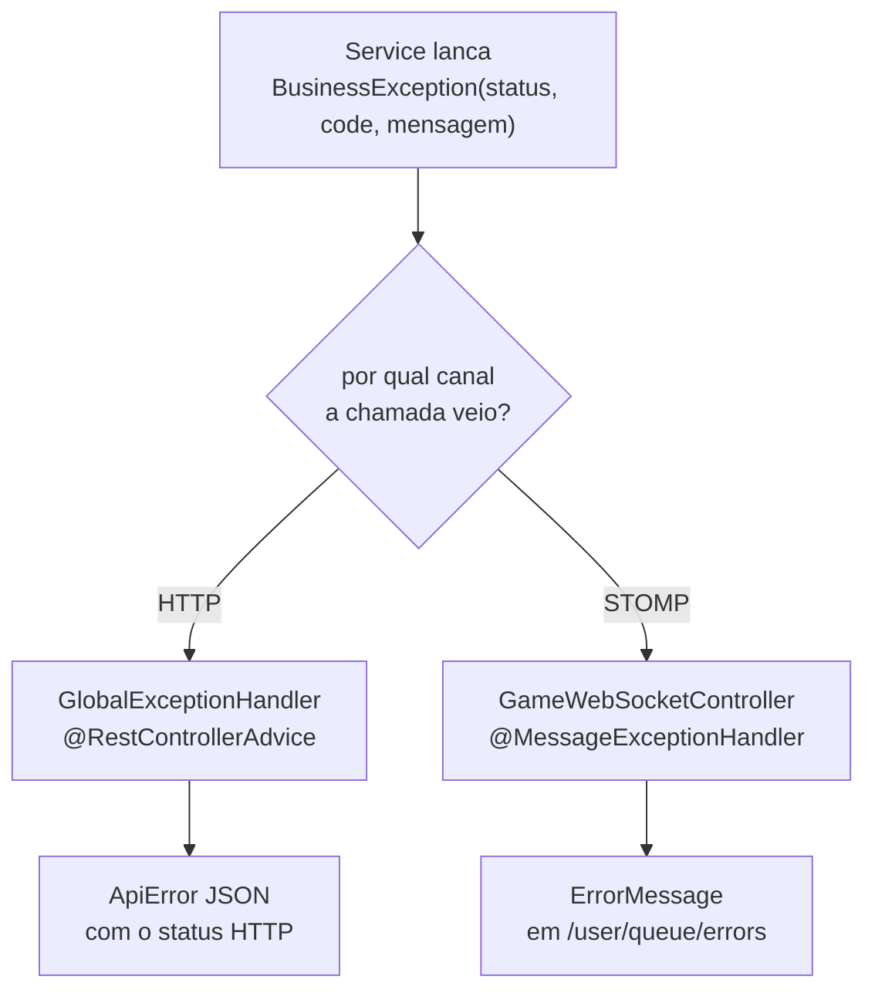

# Módulo `common` — erros e contrato de falha

O que você encontra aqui: como um erro nasce no domínio e chega ao cliente, por que existem dois
caminhos de tratamento (REST e STOMP), e a receita para adicionar um erro novo sem inventar um
formato.

Pacote: `com.sergiofagundes.chess.common`.

## Peças

| Classe | Papel |
|---|---|
| `ApiError` | o corpo JSON de todo erro REST |
| `BusinessException` | erro de negócio, com status HTTP e código |
| `ResourceNotFoundException` | atalho para 404 |
| `GlobalExceptionHandler` | converte exceção em resposta HTTP |

Fora deste pacote, mas parte do mesmo contrato:

| Classe | Papel |
|---|---|
| `game/dto/ErrorMessage` | erro enviado pelo WebSocket |
| `auth/security/RestAuthenticationEntryPoint` | 401 antes de qualquer controller |
| `game/engine/IllegalMoveException` | lance ilegal |

## O princípio

Um service **nunca** monta resposta HTTP. Ele lança uma exceção que carrega o status e um
código estável:

```java
throw new BusinessException(HttpStatus.CONFLICT, "NOT_YOUR_TURN", "Nao e a sua vez");
```

Quem traduz isso em resposta é o handler, e a tradução é a mesma em todo o sistema. O resultado:
o cliente pode confiar que **todo erro tem a mesma forma**, e o service continua sem saber se
está atrás de REST ou de WebSocket.



## `ApiError`

```java
public record ApiError(
        Instant timestamp, int status, String code,
        String message, String path, List<FieldError> fieldErrors) {
    public record FieldError(String field, String message) {}
}
```

`@JsonInclude(NON_EMPTY)` faz `fieldErrors` desaparecer do JSON quando está vazio — quem
consome não precisa tratar array vazio.

Os dois construtores estáticos `of(...)` (`common/dto/ApiError.java:19` e `:23`) são o único
caminho para criar um `ApiError`; o `timestamp` é sempre preenchido ali, nunca esquecido.

**O `code` é o contrato; a `message` é para humanos.** Clientes devem ramificar por `code`. As
mensagens podem mudar a qualquer momento (e hoje são uma mistura de português com e sem acentos,
herdada do código).

## `GlobalExceptionHandler`

`@RestControllerAdvice`, cinco handlers (`common/exception/GlobalExceptionHandler.java`):

| Exceção | Status | `code` | Linha |
|---|---|---|---|
| `BusinessException` | o que a exceção trouxer | o que a exceção trouxer | `:24` |
| `MethodArgumentNotValidException` | 400 | `VALIDATION_ERROR` (+ `fieldErrors`) | `:30` |
| `IllegalMoveException` | 422 | `ILLEGAL_MOVE` | `:39` |
| `AccessDeniedException` | 403 | `ACCESS_DENIED` | `:45` |
| `Exception` | 500 | `INTERNAL_ERROR` | `:51` |

Detalhes deliberados:

- **Só o handler de 500 escreve log** (`:53`), com a stack trace completa. Erros de negócio são
  esperados — logá-los encheria o log de ruído.
- **A mensagem do 500 é genérica.** A stack trace fica no servidor; o cliente recebe "Erro
  interno do servidor". Nada de detalhe interno vazando.
- **`IllegalMoveException` é 422**, não 400: a requisição está sintaticamente correta, mas é
  semanticamente impossível naquela posição.
- **A ordem não importa** — o Spring escolhe sempre o handler mais específico, e `Exception`
  fica como rede de segurança.

## Por que o WebSocket tem tratamento próprio

`@RestControllerAdvice` só alcança requisições HTTP. Mensagens STOMP passam por outra
infraestrutura, e uma exceção não tratada ali morreria silenciosamente — o cliente ficaria
esperando um evento que nunca chega.

Por isso `GameWebSocketController` repete a estrutura com `@MessageExceptionHandler`
(`game/GameWebSocketController.java:88-104`):

| Exceção | Resposta | Destino |
|---|---|---|
| `IllegalMoveException` | `ErrorMessage("ILLEGAL_MOVE", …)` | `/user/queue/errors` |
| `BusinessException` | `ErrorMessage(code, message)` da própria exceção | `/user/queue/errors` |
| `Exception` | `ErrorMessage("INTERNAL_ERROR", …)` + log | `/user/queue/errors` |

`@SendToUser` garante que o erro vai **só para quem enviou** a mensagem — o adversário não
recebe nada. O endereçamento usa o `Principal.getName()`, que em `AuthenticatedUser` é o UUID do
usuário.

Duas diferenças em relação ao REST:

1. **Não há tratador de validação.** Um `MoveMessage` que viole o regex é barrado pelo `@Valid`
   e cai no tratador genérico, chegando como `INTERNAL_ERROR` em vez de algo específico. Vale
   validar as casas no cliente.
2. **Não há status.** `ErrorMessage` tem só `code` e `message`; o status HTTP da
   `BusinessException` é descartado nesse caminho.

## `RestAuthenticationEntryPoint`

Sem ele, uma requisição não autenticada receberia a página de erro padrão do Spring — HTML,
fora do contrato. O entry point (`auth/security/RestAuthenticationEntryPoint.java:29`) serializa
um `ApiError` com `UNAUTHENTICATED` à mão, porque nesse ponto da cadeia de filtros nenhum
controller foi alcançado e o `@RestControllerAdvice` não existe ainda.

É o único lugar que usa o `ObjectMapper` diretamente. Note o import: `tools.jackson.databind`
(Jackson 3, o padrão do Spring Boot 4) enquanto as anotações continuam em
`com.fasterxml.jackson.annotation`.

## Receita: adicionando um erro de negócio

1. **Escolha um `code`** em `SNAKE_CASE_MAIÚSCULO`, específico o bastante para o cliente agir
   (`GAME_NOT_WAITING`, não `INVALID_STATE`).
2. **Lance do service**, nunca do controller:
   ```java
   throw new BusinessException(HttpStatus.CONFLICT, "MEU_CODIGO", "Explicacao curta");
   ```
   Para 404, use `new ResourceNotFoundException("MEU_CODIGO", "Explicacao curta")`.
3. **Não escreva handler novo** — o `GlobalExceptionHandler` já cobre, e o WebSocket também.
4. **Documente** na tabela de [api-rest.md](../api-rest.md#catálogo-de-códigos-de-erro) e, se for
   erro de jogo, em [websocket.md](../websocket.md#erros).
5. **Escreva o teste** conferindo `status` e `$.code`, no padrão de
   `GameControllerIntegrationTest`.

Escolha do status: `409` para conflito de estado (a ação faria sentido em outro momento), `403`
para "não é seu", `404` para "não existe **ou** não é seu" quando revelar a existência já seria
vazamento, `422` para entrada bem formada mas impossível.

## Vazamento de informação: 404 vs 403

`GameService.loadPlayableGame` (`game/service/GameService.java:101`) devolve `GAME_NOT_FOUND`
para quem não joga a partida, mesmo que a partida exista:

```java
if (!game.hasPlayer(userId)) {
    throw new ResourceNotFoundException("GAME_NOT_FOUND", "Partida nao encontrada");
}
```

Um `403` confirmaria que aquele ID existe. O teste "quem nao joga a partida recebe 404, e nao
403" fixa esse comportamento — não "corrija" para 403.

No WebSocket a escolha é outra: `GamePlayService.requirePlayer` (`:192`) devolve `NOT_A_PLAYER`
com 403. Faz sentido porque, para mandar uma mensagem naquele destino, a pessoa já precisava
conhecer o ID da partida.

## Veja também

- [../api-rest.md](../api-rest.md) — catálogo completo de códigos
- [../websocket.md](../websocket.md) — a fila de erros do STOMP
- [game.md](game.md) — a maior parte dos erros de negócio nasce ali
- [../testes.md](../testes.md) — como os erros são verificados
