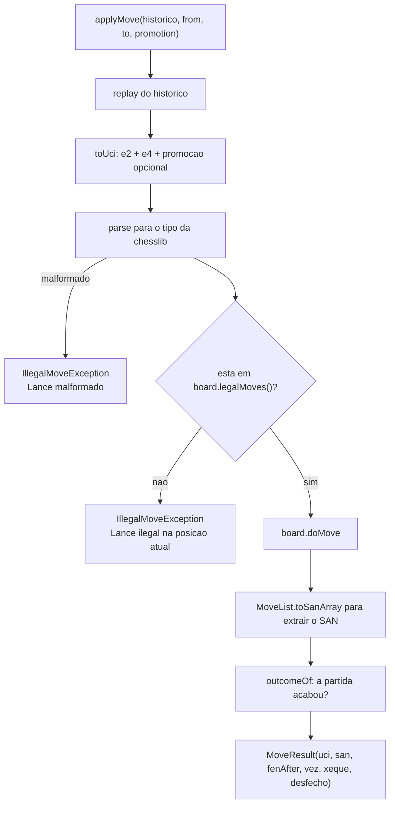

# Módulo `game.engine` — motor de regras

O que você encontra aqui: como as regras do xadrez são aplicadas, por que a posição é
reconstruída do zero a cada operação, e como o fim de partida é detectado. É o módulo mais
isolado do sistema — e o único que conhece a biblioteca de xadrez.

Pacote: `com.sergiofagundes.chess.game.engine`.

## Princípio: o servidor decide

O cliente **propõe** um lance (`from`, `to`, `promotion`). Quem decide se ele é legal é o
servidor. Um cliente adulterado não consegue mover uma peça duas casas, ignorar um xeque ou
mover a peça do adversário: nada disso passa pela validação, e o que volta é `ILLEGAL_MOVE`.

O tabuleiro do frontend é uma **projeção** do estado do servidor, nunca a autoridade.

## Peças

| Tipo | Papel |
|---|---|
| `ChessRulesService` | interface — o que o domínio conhece |
| `ChessLibRulesService` | implementação sobre a chesslib |
| `PositionInfo` | descrição de uma posição: FEN, vez, xeque, desfecho |
| `MoveResult` | resultado de um lance: UCI, SAN, FEN, vez, xeque, desfecho |
| `Outcome` | `(GameResult, Termination)` — nulo quando a partida continua |
| `IllegalMoveException` | lance recusado |

A interface tem só dois métodos:

```java
PositionInfo describe(List<String> uciHistory);
MoveResult applyMove(List<String> uciHistory, String from, String to, String promotion);
```

Ambos recebem **o histórico completo de lances** e nenhum estado mutável. O motor é sem memória:
mesma entrada, mesma saída, sempre. Isso é o que torna `ChessRulesServiceTest` legível — cada
caso monta a posição listando lances, sem fixtures.

## A decisão central: replay do histórico

Toda operação começa com um tabuleiro vazio e reproduz os lances um a um
(`ChessLibRulesService.replay`, `game/engine/ChessLibRulesService.java:79`):

```java
private static void replay(Board board, MoveList moveList, List<String> uciHistory) {
    for (var uci : uciHistory) {
        var move = new Move(uci, board.getSideToMove());
        board.doMove(move);
        moveList.add(move);
    }
}
```

**A tabela `moves` é a fonte de verdade. A coluna `games.current_fen` é cache de leitura.**

Por que não carregar o FEN e continuar dali? Porque o FEN sozinho **não carrega histórico
suficiente para aplicar todas as regras**:

| Regra | O que exige |
|---|---|
| Tríplice repetição | todas as posições anteriores da partida |
| Regra dos 50 lances | o contador de meios-lances desde a última captura ou lance de peão |
| Notação SAN correta | o contexto para desambiguar (`Nbd2` vs `Nfd2`) |

O FEN traz o contador de meios-lances, mas não o histórico de posições. Reproduzir tudo dá
essas três de graça e elimina uma classe inteira de bugs de estado divergente.

**O custo é O(n) por operação**, com n = número de lances. Uma partida longa tem 100 a 150
meios-lances; reproduzir isso é trabalho de microssegundos, feito uma vez por lance. Numa
plataforma com milhares de partidas simultâneas o cálculo mudaria — aí a saída seria manter um
`Board` em cache por partida ativa, sem alterar a interface. Registrado em
[decisoes.md](../decisoes.md).

## Aplicando um lance

`applyMove` (`:31`):



Pontos que valem atenção:

- **A checagem é contra `legalMoves()`**, e não uma validação artesanal. Um lance que deixa o
  próprio rei em xeque simplesmente não está na lista.
- **`parse` (`:87`) embrulha a exceção da biblioteca.** Uma entrada malformada estouraria uma
  `RuntimeException` genérica da chesslib; aqui ela vira `IllegalMoveException`, e o tipo da
  biblioteca não escapa do pacote. Há teste dedicado a isso ("recusa lance malformado sem
  estourar tipo da biblioteca").
- **O SAN é extraído depois de aplicar**, via `MoveList.toSanArray()` (`:46`) — a notação
  depende do contexto, então não dá para montá-la a partir do UCI isolado.
- **A normalização é minúscula** (`toUci`, `:95`): `E2`/`e2` dá no mesmo, e a promoção vira
  `q`, `r`, `b` ou `n`.

### Casas em vez de peças

A API fala em casas de origem e destino, nunca em nome de peça:

| Lance | Enviado como |
|---|---|
| `e4` | `from: "e2", to: "e4"` |
| Roque curto das brancas | `from: "e1", to: "g1"` — a torre é movida pelo motor |
| Roque longo | `from: "e1", to: "c1"` |
| En passant | `from: "e5", to: "d6"` — o peão capturado sai sozinho |
| Promoção a dama | `from: "g7", to: "h8", promotion: "q"` |
| Subpromoção a cavalo | `from: "g7", to: "h8", promotion: "n"` |

Promoção **sem** o campo `promotion` é rejeitada como ilegal — comportamento coberto pelo teste
"recusa promocao sem informar a peca".

## Detecção de fim de partida

`outcomeOf` (`:57`) é consultado depois de cada lance e devolve `null` quando a partida
continua. A **ordem das verificações importa**:

| Ordem | Condição | Resultado | `Termination` |
|---|---|---|---|
| 1 | `board.isMated()` | vence quem **não** está na vez | `CHECKMATE` |
| 2 | `board.isStaleMate()` | empate | `STALEMATE` |
| 3 | `board.isInsufficientMaterial()` | empate | `INSUFFICIENT_MATERIAL` |
| 4 | `board.isRepetition()` | empate | `THREEFOLD_REPETITION` |
| 5 | `board.getHalfMoveCounter() >= 100` | empate | `FIFTY_MOVE` |

Mate vem primeiro porque é decisivo: se o lado da vez está mateado, nada mais importa. Um mate
que também completa a regra dos 50 lances é mate.

O detalhe da inversão em `:58-62`: quando há mate, quem perdeu é **quem está na vez** (é ele que
não tem lance legal). Por isso `sideToMove == WHITE` produz `BLACK_WIN`.

`getHalfMoveCounter() >= 100` são **100 meios-lances**, ou seja 50 lances de cada lado sem
captura nem movimento de peão — a regra dos 50 lances. `FiftyMoveRuleTest` cobre a fronteira
exata: 99 meios-lances não empatam, 100 empatam.

> A regra dos 50 lances e a tríplice repetição são aplicadas **automaticamente** aqui, sem
> ninguém precisar reivindicar. Em torneio oficial a tríplice repetição é reivindicável (o
> empate automático é na quíntupla); esta implementação simplifica para empate direto.

## Xeque

`PositionInfo.check` e `MoveResult.check` vêm de `board.isKingAttacked()` e significam sempre
**"o rei de quem joga agora está atacado"**. Depois de um lance das brancas que dá xeque,
`check: true` e `turn: "BLACK"` — é o rei preto que está em xeque.

## Trocando a biblioteca

A chesslib aparece em exatamente um arquivo. Para trocá-la:

1. Escreva outra implementação de `ChessRulesService`.
2. Garanta que `PositionInfo` e `MoveResult` sejam preenchidos com a mesma semântica.
3. Rode `ChessRulesServiceTest` e `FiftyMoveRuleTest` — são 21 casos escritos contra a
   **interface**, não contra a biblioteca. Se passarem, a troca está feita.
4. Remova a dependência do `pom.xml` (ela vem do JitPack).

Este é o retorno concreto da inversão de dependência: a decisão de biblioteca continua
reversível.

## Veja também

- [game.md](game.md) — quem chama o motor e o que faz com o resultado
- [../banco-de-dados.md](../banco-de-dados.md) — a tabela `moves`, o log que alimenta o replay
- [../glossario.md](../glossario.md) — FEN, SAN, UCI, ply e o resto do vocabulário
- [../testes.md](../testes.md) — os testes de regra, os mais baratos do repositório
