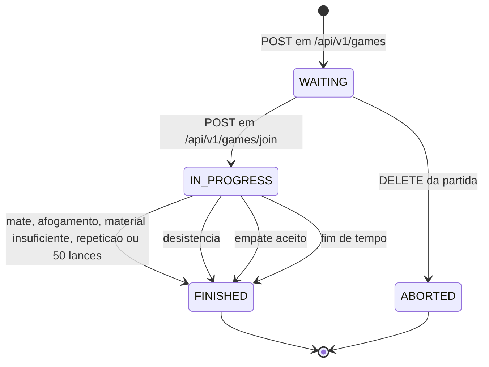
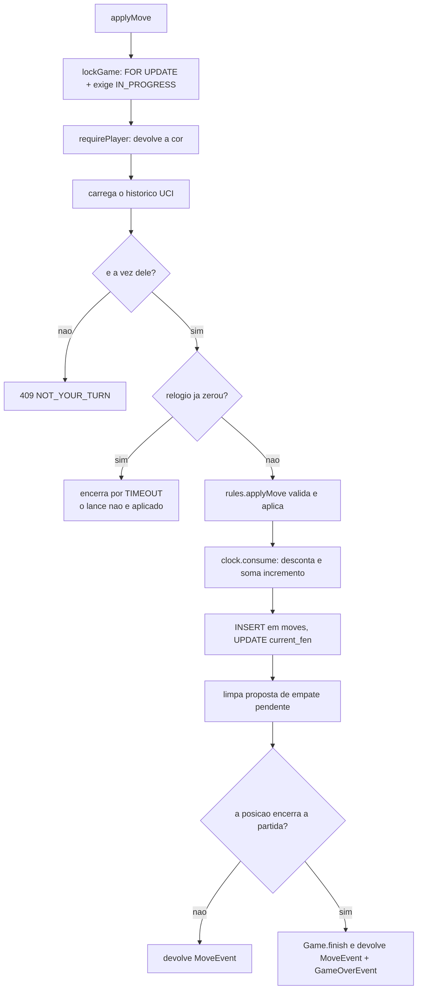

# Módulo `game`

O que você encontra aqui: o ciclo de vida de uma partida do zero ao resultado, como o código de
convite é gerado, por que existem dois services separados e como cada ação de jogo é
processada. As regras de xadrez em si estão em [engine.md](engine.md); o relógio, em
[relogio.md](relogio.md).

Pacote: `com.sergiofagundes.chess.game`.

## Peças

| Classe | Papel |
|---|---|
| `Game`, `Move` | entidades JPA, com a lógica de domínio que cabe nelas |
| `GameStatus`, `GameResult`, `Termination`, `PieceColor` | enums do domínio |
| `GameController` | REST: criar, entrar, consultar, cancelar |
| `GameWebSocketController` | STOMP: lance, desistência, empate |
| `GameService` | ciclo de vida da partida |
| `GamePlayService` | partida em andamento |
| `GameEventPublisher` | publica eventos no broker |
| `GameClockCoordinator`, `TimeoutScheduler`, `ClockService` | relógio |
| `DrawOfferRegistry` | propostas de empate pendentes, em memória |
| `JoinCodeGenerator` | código de convite |

## Dois services, duas responsabilidades

A divisão é a espinha do módulo:

| | `GameService` | `GamePlayService` |
|---|---|---|
| Canal | REST | STOMP |
| Escopo | ciclo de vida: criar, entrar, consultar, cancelar | jogo em andamento: lance, desistência, empate, timeout |
| Trava a partida? | não | sim, `SELECT FOR UPDATE` |
| Devolve | `GameStateResponse` (estado completo) | `List<GameEvent>` (o que mudou) |

Repare no formato de retorno: as operações de jogo devolvem **eventos**, não estado. Quem
publica é o controller, depois que a transação fecha. Isso mantém o service ignorante quanto ao
transporte e garante que nada é transmitido antes do commit.

## Máquina de estados



| Transição | Quem faz | O que muda |
|---|---|---|
| → `WAITING` | `GameService.create` (`:48`) | cria com `INITIAL_FEN`, relógios cheios, um lado ocupado |
| `WAITING` → `IN_PROGRESS` | `Game.join` (`game/Game.java:132`) | ocupa o lado vago, grava `started_at` e `last_move_at` |
| `WAITING` → `ABORTED` | `GameService.cancel` (`:85`) | só antes de começar |
| `IN_PROGRESS` → `FINISHED` | `Game.finish` (`:143`) | grava `result`, `termination` e `ended_at` |

`ABORTED` é um estado terminal e **não tem `result`** — a partida não aconteceu. Não há
transição de volta: nem `FINISHED` nem `ABORTED` voltam para `IN_PROGRESS`.

## Criando uma partida

`GameService.create` (`game/service/GameService.java:48`):

1. Gera o código de convite.
2. Resolve a cor: `PreferredColor.resolve()` transforma `RANDOM` em `WHITE` ou `BLACK` com
   `SecureRandom`, **no momento da criação** — a resposta já informa a cor definitiva.
3. Constrói o `Game` com `INITIAL_FEN` (`game/Game.java:32`), os dois relógios em
   `initialTimeSeconds * 1000` e o criador em um dos lados.
4. Persiste e devolve o estado.

O construtor do `Game` (`:90`) é o único caminho para criar uma partida — não existe setter
público para `joinCode`, `initialTimeSeconds` nem `incrementSeconds`, todos marcados
`updatable = false`.

### O código de convite

`JoinCodeGenerator` (`game/service/JoinCodeGenerator.java`):

- Alfabeto: `23456789ABCDEFGHJKMNPQRSTUVWXYZ` (`:12`) — 31 caracteres.
- **Faltam de propósito `0`, `O`, `1`, `I` e `L`**: são os pares que as pessoas mais confundem
  ao ditar um código por voz ou copiar de uma tela.
- 6 caracteres (`:14`) → 31⁶ ≈ 887 milhões de combinações.
- Até 10 tentativas (`:15`) até achar um código livre; se todas colidirem, estoura
  `IllegalStateException` (que vira `500`). Com esse espaço de chaves, é cenário de tabela
  praticamente cheia.

A coluna aceita `VARCHAR(8)` embora o gerador produza 6 — folga para mudar o tamanho sem
migration.

## Entrando numa partida

`GameService.joinByCode` (`:62`) valida, nesta ordem:

1. Código existe? → `404 INVALID_JOIN_CODE`
2. Status é `WAITING`? → `409 GAME_NOT_WAITING`
3. Você já está na partida? → `409 CANNOT_JOIN_OWN_GAME`

Passando, `Game.join` (`game/Game.java:132`) ocupa o lado vago via `openSeat()`, muda o status e
grava `started_at` **e** `last_move_at` — este último é o marco a partir do qual o relógio das
brancas começa a correr.

O `GameController.join` (`game/GameController.java:53`) faz mais duas coisas depois do service:
publica `GAME_STARTED` no tópico e chama `clock.arm(gameId)`. Ou seja, **o relógio começa a
contar no REST**, não no primeiro lance.

O código chega normalizado: o próprio `JoinGameRequest` faz `trim` e `toUpperCase` no construtor
canônico (`game/dto/JoinGameRequest.java`), então `" k7m2qp "` funciona.

## Ações durante a partida

Todas em `GamePlayService`, todas começando pelas mesmas duas guardas: `lockGame` (`:175`, que
trava e exige `IN_PROGRESS`) e `requirePlayer` (`:192`, que exige ser um dos dois jogadores e
devolve a cor).

### Lance — `applyMove` (`:50`)



Dois detalhes com consequência visível para o cliente:

- **O relógio é conferido antes da regra** (`:62`). Se o tempo acabou, o lance é descartado e a
  partida termina por `TIMEOUT` — mesmo que o lance fosse mate.
- **Um lance limpa qualquer proposta de empate pendente** (`:76`). Jogar equivale a recusar.

O `ply` é `history.size() + 1` (`:70`). Como toda a operação acontece sob o lock da partida, e
`uq_moves_game_ply` cobre o resto, não há como dois lances receberem o mesmo número.

### Desistência — `resign` (`:132`)

Encerra imediatamente com vitória do adversário e `RESIGNATION`. Não há confirmação nem
desfazer. Também limpa proposta pendente.

### Proposta de empate — `offerDraw` (`:144`)

Registra a cor de quem propôs em `DrawOfferRegistry` e devolve `DrawOfferedEvent`. É a única
operação de jogo **sem lock** e marcada `@Transactional(readOnly = true)`: ela não escreve nada
no banco, só num mapa em memória.

Uma proposta nova sobrescreve a anterior — o `Map` guarda uma por partida.

### Resposta ao empate — `respondToDraw` (`:153`)

1. Há proposta pendente? → senão, `409 NO_DRAW_OFFER`
2. A proposta é do adversário? → senão, `409 CANNOT_ANSWER_OWN_OFFER`
3. Limpa a proposta.
4. Recusou → lista vazia de eventos, ninguém é notificado. Aceitou → `Game.finish(DRAW,
   DRAW_AGREEMENT)` e `GameOverEvent`.

> **Recusa é silenciosa.** O servidor não emite evento nenhum quando alguém recusa
> (`:167-168`), então quem propôs não recebe aviso. Se o produto precisar de "sua proposta foi
> recusada", isso é código novo.

### Fim de tempo — `flagIfExpired` (`:108`)

Chamado pelo `GameClockCoordinator`, não por um jogador. Trava a partida, confere se o tempo de
quem está na vez realmente acabou e, se sim, encerra com `TIMEOUT`. Se ainda sobra tempo,
devolve lista vazia e o coordenador reagenda. Ver [relogio.md](relogio.md).

## `DrawOfferRegistry`: estado fora do banco

```java
private final Map<UUID, PieceColor> offersByGame = new ConcurrentHashMap<>();
```

Uma proposta por partida, guardada só na memória do processo. As consequências:

- Reiniciar o servidor **apaga todas as propostas pendentes**. Quem propôs continua vendo
  "aguardando"; quem responder recebe `NO_DRAW_OFFER`.
- Com mais de uma réplica, a proposta feita numa instância é invisível na outra.
- Uma proposta nunca expira sozinha — sai quando é respondida, quando alguém joga ou quando a
  partida acaba.

Trocar esse mapa por uma coluna em `games` resolveria os três pontos. A escolha atual é
simplicidade, e está registrada em [decisoes.md](../decisoes.md).

## Montagem do `GameStateResponse`

`GameService.state` (`:112`) monta a resposta:

1. Carrega o histórico UCI e os lances completos.
2. `rules.describe(history)` reconstrói a posição — daí saem `turn` e `check`.
3. `clock.snapshot(...)` calcula os relógios já descontando o tempo corrido.
4. `GameStateResponse.of(game, viewerId, moves, position, clock)` junta tudo.

O campo `yourColor` vem de `game.colorOf(viewerId)` (`game/Game.java:154`): **a mesma partida
gera respostas diferentes para jogadores diferentes**. É o único campo do DTO que depende de
quem perguntou.

## Veja também

- [engine.md](engine.md) — validação de lances e detecção de fim de partida
- [relogio.md](relogio.md) — `arm`, `disarm` e a corrida com o timeout
- [../websocket.md](../websocket.md) — o formato dos eventos que os handlers devolvem
- [../api-rest.md](../api-rest.md) — o contrato REST do ciclo de vida
- [../banco-de-dados.md](../banco-de-dados.md) — tabelas `games` e `moves`
