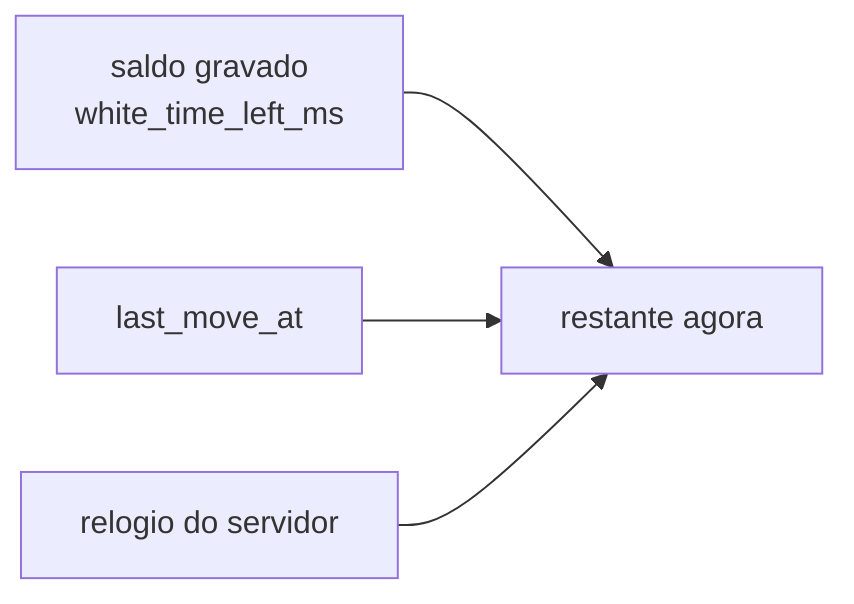
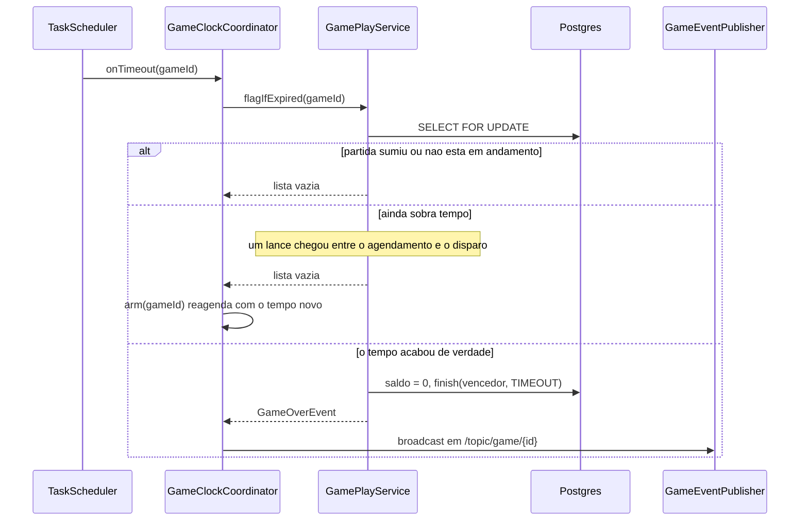

# Módulo do relógio

O que você encontra aqui: como o tempo de cada jogador é contado, descontado e incrementado,
como o fim de tempo é detectado sem ninguém estar olhando, e por que existe uma margem de
250 ms no agendamento.

Classes: `ClockService`, `TimeoutScheduler`, `GameClockCoordinator` (em
`com.sergiofagundes.chess.game.service`) e `SchedulingConfig`.

## O modelo: saldo congelado + marco temporal

O banco **não guarda um relógio correndo**. Guarda duas coisas por partida:

| Coluna | Significado |
|---|---|
| `white_time_left_ms` / `black_time_left_ms` | saldo de cada lado **no instante do último lance** |
| `last_move_at` | quando esse último lance aconteceu |

O tempo real de quem está na vez é sempre calculado:

```
restante = saldo_gravado - (agora - last_move_at)
```

É por isso que nenhuma thread precisa decrementar contadores, e por isso o estado sobrevive a
um reinício: o marco temporal está no banco.



`last_move_at` é preenchido em dois momentos: quando a partida começa
(`Game.join`, `game/Game.java:132`) e a cada lance (`ClockService.consume`). Ou seja, o relógio
das brancas começa a correr no instante em que o segundo jogador entra — não no primeiro lance.

## `ClockService`: a aritmética

Aritmética pura, sem banco e sem relógio próprio — o `Instant now` sempre vem de fora, o que
torna a classe trivial de testar (`ClockServiceTest`, 7 casos sem nenhum mock).

### `consume` (`game/service/ClockService.java:17`)

Chamado quando um lance é aceito:

```java
var spent = elapsedSince(game.getLastMoveAt(), now);
var remaining = game.timeLeftMs(mover) - spent + game.getIncrementSeconds() * 1000L;
game.setTimeLeftMs(mover, Math.max(0, remaining));
game.setLastMoveAt(now);
return spent;
```

Três coisas de uma vez: desconta o tempo gasto, **soma o incremento** e reposiciona o marco. O
retorno (`spent`) vai para `moves.time_spent_ms`, alimentando estatísticas por lance.

O incremento é somado **depois** do lance, no estilo Fischer: quem joga em 3 segundos com
incremento de 2 fica com 1 segundo a menos, não 3.

`Math.max(0, ...)` garante que o saldo nunca fica negativo — o teste "nunca deixa o tempo
restante negativo" trava esse comportamento.

### `remainingForSideToMove` (`:27`)

Quanto resta, agora, para quem está na vez. É a base de duas decisões: recusar um lance de quem
já estourou o tempo (`GamePlayService:62`) e definir quando o timeout deve disparar.

### `snapshot` (`:32`)

Os dois relógios para exibição, sem persistir nada:

- Partida **fora de `IN_PROGRESS`** → devolve os valores gravados, congelados. Uma partida
  encerrada mostra sempre o mesmo tempo, quantas vezes for consultada.
- Partida em andamento → desconta o tempo corrido **apenas de quem está na vez**. O relógio do
  adversário fica parado, como num relógio de xadrez real.

É o que alimenta `whiteTimeLeftMs`/`blackTimeLeftMs` no `GameStateResponse`.

## `TimeoutScheduler`: um agendamento por partida

`game/service/TimeoutScheduler.java` mantém um `ConcurrentHashMap<UUID, ScheduledFuture<?>>` e
roda sobre o `TaskScheduler` de `SchedulingConfig` (2 threads, prefixo `chess-clock-`,
`setRemoveOnCancelPolicy(true)` para que tarefas canceladas não se acumulem na fila).

```java
private static final Duration GRACE = Duration.ofMillis(250);
…
var firesAt = Instant.now().plusMillis(remainingMs).plus(GRACE);
```

**Por que a margem de 250 ms** (`:20`): sem ela, o agendamento dispararia no instante teórico do
fim do tempo, e a mínima diferença entre o cálculo e o relógio na hora de acordar faria
`flagIfExpired` encontrar "ainda sobra 1 ms". O resultado seria reagendamento em cascata,
queimando CPU no fim de cada partida apertada. A margem custa um atraso imperceptível e resolve
o problema.

`schedule` sempre chama `cancel` antes (`:30`), então nunca existem dois agendamentos para a
mesma partida. Exceções dentro da tarefa são capturadas e logadas (`:37-39`) — uma falha no fim
de tempo de uma partida não derruba a thread do scheduler.

## `GameClockCoordinator`: quem arma e desarma

É a fronteira entre o mundo transacional (`GamePlayService`) e o agendamento.

```java
public void arm(UUID gameId) {
    var remaining = playService.remainingMsForSideToMove(gameId);
    if (remaining < 0) {          // partida inexistente ou fora de IN_PROGRESS
        scheduler.cancel(gameId);
        return;
    }
    scheduler.schedule(gameId, remaining, () -> onTimeout(gameId));
}
```

`remainingMsForSideToMove` devolve **-1** como sentinela de "não há o que agendar"
(`GamePlayService:98-101`) — partida que não existe ou que não está em andamento. Zero é um
valor legítimo: significa "o tempo acabou, dispare agora".

Chamadas de `arm` e `disarm`:

| Momento | Chamada | Onde |
|---|---|---|
| segundo jogador entra | `arm` | `GameController.java:63` |
| lance aceito, partida continua | `arm` | `GameWebSocketController.java:84` |
| lance encerra a partida | `disarm` | `GameWebSocketController.java:82` |
| desistência | `disarm` | `GameWebSocketController.java:61` |
| resposta a empate | `arm` ou `disarm` | `GameWebSocketController.java:76` |

Todas acontecem **no controller, depois da transação**. Agendar de dentro da transação abriria a
janela para o timeout disparar antes do commit e ler um estado que ainda não existe no banco.

## O disparo do timeout



O ramo do meio é o que garante a correção. Entre agendar e acordar, um lance pode ter chegado e
mudado tudo: outro lado na vez, outro saldo. `flagIfExpired` recalcula sob lock e, se não é hora
de derrubar a bandeira, devolve lista vazia — e o coordenador reagenda com o valor atual.

A corrida oposta — lance e timeout ao mesmo tempo — é resolvida pelo `SELECT FOR UPDATE`, que
os dois caminhos usam. Quem chegar primeiro ganha; o outro encontra a partida já encerrada, ou
com o tempo já consumido.

`flag` (`GamePlayService:123`) zera o saldo de quem estourou antes de encerrar, para que a UI
mostre `0:00` em vez de um resto de milissegundos.

## Sincronização com o cliente

Cada `MoveEvent` carrega `whiteTimeLeftMs`, `blackTimeLeftMs` e `serverTimestamp`. O cliente
deve:

1. Adotar os valores do evento como verdade.
2. Contar localmente a partir dali, para animação.
3. Corrigir no evento seguinte.

Nunca acumule diferenças locais: elas divergem, e o servidor é quem decide quando o tempo acaba.

Duas coisas que **não** existem hoje:

- **Compensação de latência.** O tempo gasto inclui a viagem de rede. Numa conexão ruim o
  jogador paga por ela.
- **Sinal de "restam 10 segundos".** Não há evento periódico de relógio; o cliente precisa
  produzir seus próprios avisos a partir do último evento recebido.

## Limitações

| Limitação | Efeito |
|---|---|
| Agendamento em memória | reiniciar o servidor perde os timeouts; uma partida abandonada não termina sozinha até alguém interagir |
| Instância única | com duas réplicas, cada uma agendaria o mesmo timeout |
| Sem compensação de latência | a rede consome tempo do jogador |
| Sem evento periódico de relógio | avisos de tempo baixo ficam por conta do cliente |

Recuperar agendamentos no startup seria simples — varrer as partidas `IN_PROGRESS` e chamar
`arm` em cada uma. Não está implementado.

## Veja também

- [game.md](game.md) — onde `consume` e `flagIfExpired` são chamados
- [../banco-de-dados.md](../banco-de-dados.md) — as colunas de tempo em `games` e `moves`
- [../websocket.md](../websocket.md) — os campos de relógio no `MOVE`
- [../testes.md](../testes.md) — `ClockServiceTest` e o teste de fim de tempo por WebSocket
