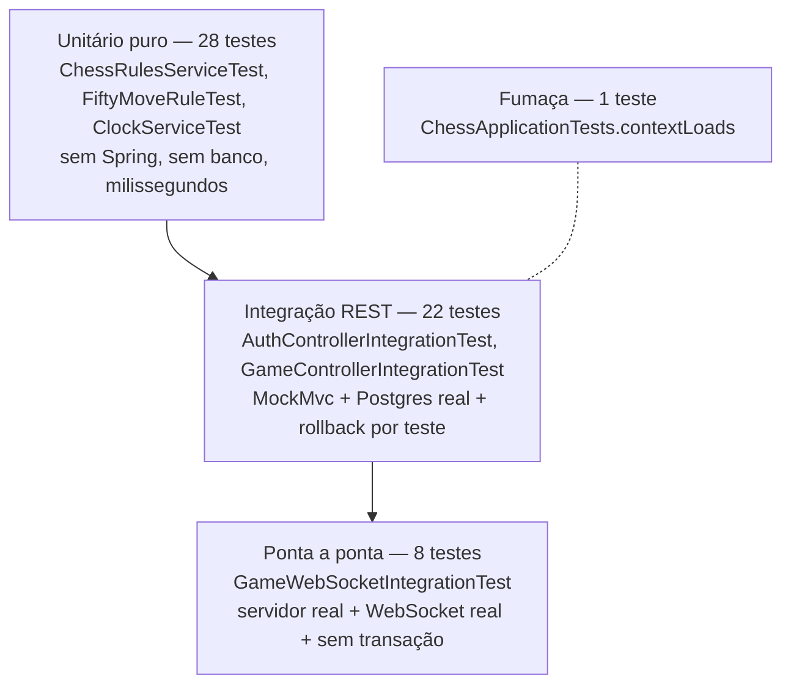

# Testes

O que você encontra aqui: como a suíte é organizada em três camadas, por que cada camada existe,
o que está coberto hoje e onde estão os buracos.

São **59 testes** em 7 classes, todos em `src/test/java/com/sergiofagundes/chess/`.

```bash
./mvnw test
```

**O Docker precisa estar rodando**: quatro das sete classes sobem um Postgres real via
Testcontainers.

## As três camadas



| Camada | Classes | Testes | O que prova |
|---|---|---|---|
| Unitário | `ChessRulesServiceTest`, `FiftyMoveRuleTest`, `ClockServiceTest` | 19 + 2 + 7 | regras de xadrez e aritmética do relógio |
| Integração REST | `AuthControllerIntegrationTest`, `GameControllerIntegrationTest` | 10 + 12 | contrato HTTP, segurança, persistência |
| Ponta a ponta | `GameWebSocketIntegrationTest` | 8 | o protocolo STOMP funcionando de verdade |
| Fumaça | `ChessApplicationTests` | 1 | o contexto sobe e as migrations aplicam |

A pirâmide é sadia: a maior parte dos testes é rápida e sem infraestrutura, e o topo caro cobre
o que só existe na integração.

## Camada 1: unitário puro

Sem Spring, sem banco, sem mock. Os alvos são classes deliberadamente puras:

- **`ChessRulesServiceTest`** (19 testes) — instancia `ChessLibRulesService` diretamente. Cada
  caso monta a posição listando os lances anteriores, o que torna o teste legível como uma
  partida:

  ```java
  var resultado = rules.applyMove(List.of("e2e4", "e7e5"), "g1", "f3", null);
  ```

  Cobre: lance simples, lance geometricamente impossível, mover peça do adversário, ignorar
  xeque, peça cravada, mate do pastor, xeque que não encerra, afogamento, tríplice repetição,
  roque curto e longo, en passant, promoção e subpromoção, promoção sem peça informada, lance
  malformado, e `describe` em três situações.

- **`FiftyMoveRuleTest`** (2 testes) — a fronteira exata da regra: 99 meios-lances **não**
  empatam, 100 empatam. Um caso de borda que mereceu classe própria.

- **`ClockServiceTest`** (7 testes) — a razão de `ClockService` receber `Instant now` por
  parâmetro em vez de chamar `Instant.now()` internamente: dá para testar tempo sem esperar nem
  mockar relógio. Cobre desconto com incremento, atualização do marco, saldo nunca negativo, só
  o lado da vez correndo, partida encerrada congelada e partida em espera sem consumo.

## Camada 2: integração REST

`AbstractIntegrationTest` (`src/test/java/com/sergiofagundes/chess/AbstractIntegrationTest.java`)
é a base:

```java
@SpringBootTest
@AutoConfigureMockMvc
@Import(TestcontainersConfiguration.class)
@Transactional
public abstract class AbstractIntegrationTest {
```

Quatro decisões embutidas:

| Anotação | Efeito |
|---|---|
| `@SpringBootTest` | contexto completo, sem mocks de infraestrutura |
| `@AutoConfigureMockMvc` | requisições HTTP sem subir servidor — rápido |
| `@Import(TestcontainersConfiguration)` | Postgres real, com as migrations aplicadas de verdade |
| `@Transactional` | cada teste roda numa transação com rollback no fim |

O rollback é o que torna a **ordem dos testes irrelevante**: nenhum caso enxerga o que outro
escreveu, e não há script de limpeza.

O helper `registerAndAuthorize(username)` registra um usuário pela própria API e devolve o
header `Authorization` pronto. Autenticar pelo caminho real, em vez de forjar um token, faz o
registro ser exercitado de graça em todo teste de partida.

### `TestcontainersConfiguration`

```java
@Bean
@ServiceConnection
PostgreSQLContainer postgresContainer() {
    return new PostgreSQLContainer("postgres:16-alpine");
}
```

`@ServiceConnection` injeta URL, usuário e senha automaticamente — nada de `@DynamicPropertySource`.
O container sobe em **porta aleatória**, então não conflita com o Postgres do compose nem com
outro que exista na máquina.

Nota de versão: o Testcontainers 2.x moveu a classe para `org.testcontainers.postgresql` e
removeu o parâmetro genérico da 1.x (era `PostgreSQLContainer<?>`). Exemplos antigos da internet
não compilam aqui.

### O que está coberto

**`AuthControllerIntegrationTest`** (10 testes): registro com cookie `HttpOnly`, username e
e-mail duplicados ignorando maiúsculas, erro por campo na validação, login por username e por
e-mail, senha errada e usuário inexistente devolvendo resposta idêntica, rotação no refresh,
refresh sem cookie, logout revogando, e rota protegida sem token no formato `ApiError`.

**`GameControllerIntegrationTest`** (12 testes): criação com código e cor, alfabeto do código sem
`0/O` e `1/I/L`, cor preta deixando as brancas vagas, entrada por código iniciando a partida,
código com minúsculas e espaços, recusa de entrar na própria partida, código inexistente,
terceiro jogador em partida iniciada, 404 (e não 403) para quem não joga, ausência de token,
cancelamento antes de começar e recusa de cancelar depois.

## Camada 3: ponta a ponta

`GameWebSocketIntegrationTest` é diferente de tudo:

```java
@SpringBootTest(webEnvironment = SpringBootTest.WebEnvironment.RANDOM_PORT)
@Import(TestcontainersConfiguration.class)
class GameWebSocketIntegrationTest {
```

Servidor HTTP real em porta aleatória, `WebSocketStompClient` real, Postgres real. **Sem
`@Transactional`** — e essa ausência é o ponto mais importante da classe:

> Os handlers STOMP rodam em **outra thread**. Uma transação de teste não os alcança, e o
> rollback não desfaria o que eles escreveram. Por isso cada caso cria seus próprios usuários
> com nomes únicos, e o estado fica no banco.

Para escrever no banco fora dos handlers, a classe usa `TransactionTemplate` explicitamente. A
sincronização é feita com `BlockingQueue` e `poll(5, TimeUnit.SECONDS)`: o teste espera o evento
chegar, com timeout, em vez de dormir por um tempo fixo.

Os 8 casos: lance válido chegando aos dois jogadores com ply/SAN/FEN, lance fora da vez
(`NOT_YOUR_TURN`), lance ilegal (`ILLEGAL_MOVE`), não-jogador (`NOT_A_PLAYER`), desistência
avisando os dois, xeque-mate encerrando junto com o lance, fim de tempo quando o relógio zera, e
relógios atualizados a cada lance.

Este é o único teste que prova que **a cadeia inteira funciona**: autenticação no CONNECT,
roteamento por `@MessageMapping`, transação, broadcast no tópico e entrega aos dois clientes.
Quando estiver em dúvida sobre o protocolo, leia esta classe — é a especificação executável.

## Camada 4: fumaça

```java
@Test
void contextLoads() {
    // Garante que o contexto sobe e que as migrations do Flyway aplicam
    // contra um Postgres limpo -- inclusive o ddl-auto=validate das entidades.
}
```

Um teste vazio que vale muito: ele pega **toda** divergência entre entidade JPA e esquema. Se
você mexeu numa entidade e esqueceu a migration, este é o teste que falha primeiro.

## Convenções

| Convenção | Exemplo |
|---|---|
| `@DisplayName` em português, descrevendo comportamento | `"refresh emite um cookie novo e invalida o anterior (rotacao)"` |
| Nome do método em português, sem acentos | `partidaEncerradaCongelaORelogio` |
| Asserções sobre o **contrato**, não sobre a implementação | `jsonPath("$.code").value("NOT_YOUR_TURN")` |
| Um comportamento por teste | — |
| Sem mocks nos testes de integração | Postgres real |

Repare que praticamente não há `Mockito` na suíte. Isso é possível porque as classes puras são
puras de verdade e o resto é testado com infraestrutura real.

## Escrevendo um teste novo

**Regra de xadrez ou aritmética de relógio** → classe unitária. Instancie a classe direto,
monte a posição pela lista de lances.

**Rota REST** → estenda `AbstractIntegrationTest`, use `registerAndAuthorize`, verifique status e
`$.code`:

```java
@Test
@DisplayName("descreve o comportamento esperado")
void nomeDoMetodo() throws Exception {
    var auth = registerAndAuthorize("jogador1");

    mockMvc.perform(post("/api/v1/games")
                    .header(HttpHeaders.AUTHORIZATION, auth)
                    .contentType(MediaType.APPLICATION_JSON)
                    .content("""
                            {"preferredColor":"WHITE","timeControl":{"initialSeconds":300,"incrementSeconds":0}}
                            """))
            .andExpect(status().isCreated())
            .andExpect(jsonPath("$.status").value("WAITING"));
}
```

**Comportamento de WebSocket** → siga o padrão de `GameWebSocketIntegrationTest`: usuários
próprios, sem `@Transactional`, `BlockingQueue` com timeout.

## Lacunas conhecidas

Vale saber o que a suíte **não** garante hoje:

| Não coberto | Risco |
|---|---|
| Refresh token **expirado** (só o revogado é testado) | a checagem de `expiresAt` não tem teste |
| `revokeAllForUser` | método sem chamador e sem teste |
| Cancelamento por quem não criou a partida | comportamento não fixado por teste |
| Empate: proposta, aceite e recusa | fluxo completo sem cobertura de WebSocket |
| Material insuficiente | é o único desfecho de `outcomeOf` sem teste |
| Concorrência real (dois lances simultâneos) | o lock pessimista não é exercitado sob disputa |
| Reconexão e ressincronização | fluxo não testado |
| Colisão de código de convite | o laço de 10 tentativas nunca é exercitado |

O primeiro e o quarto são os mais fáceis de fechar e os que mais valem: a expiração é a única
regra de refresh token sem cobertura, e o empate é a única ação de jogo sem teste ponta a ponta.

## Veja também

- [desenvolvimento.md](desenvolvimento.md) — comandos e troubleshooting da suíte
- [modulos/engine.md](modulos/engine.md) — o que os testes de regra provam
- [modulos/relogio.md](modulos/relogio.md) — por que `ClockService` é fácil de testar
- [websocket.md](websocket.md) — o protocolo que o teste ponta a ponta exercita
